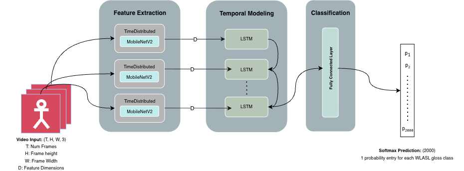

## Model Architecture

The core of this project is a hybrid **CNN-LSTM** architecture designed to recognize isolated American Sign Language (ASL) signs. The model classifies short video clips (approx. 30 frames) into one of 2,000 gloss categories from the WLASL dataset.

To accurately identify signs, the model must capture two distinct types of information:
1.  **Spatial Features:** Hand shapes, positions, and facial expressions within individual frames.
2.  **Temporal Dynamics:** The motion trajectory and sequence of the gesture across time.

While 3D-CNNs process space and time jointly, they are often computationally prohibitive. Instead, we utilize a Convolutional-Recurrent approach which separates spatial and temporal processing into specialized stages, balancing efficiency with expressive power.

*Figure 1: Overview of the CNN-LSTM architecture. Video frames are processed per-frame by a TimeDistributed MobileNetV2 backbone to produce a sequence of frame-level features, which are then aggregated by an LSTM for classification.*

### 1. Spatial Feature Extraction (CNN)
The first stage converts each video frame into a compact feature vector.
* **Backbone:** We utilize **MobileNetV2**, pre-trained on ImageNet, as the convolutional backbone. This architecture was selected for its lightweight efficiency, allowing for the processing of large video datasets on limited resources.
* **TimeDistributed Layer:** To handle 3D video input (Time × Height × Width × Channels), the MobileNetV2 model is wrapped in a Keras `TimeDistributed` layer. This applies the CNN to each frame independently, resulting in a sequence of feature vectors.
* **Optimization:** The pre-trained weights of the backbone are frozen to reduce the number of trainable parameters, accelerating training time and reducing the risk of overfitting.

### 2. Temporal Modeling (LSTM)
The sequence of frame-level feature vectors is fed into a **Long Short-Term Memory (LSTM)** network.
* Unlike standard RNNs, the LSTM is designed to capture long-term dependencies, making it ideal for modeling the full duration of a sign gesture.
* The LSTM processes the entire sequence and outputs a final hidden state that summarizes the spatio-temporal content of the video clip.

### 3. Classification Head
The final stage maps the learned representation to a class label.
* The LSTM output is passed through a **Fully Connected (Dense)** layer.
* A **Softmax** activation function generates a probability distribution over the 2,000 ASL gloss classes.
* The class with the highest probability is selected as the final prediction.

## References

This project is inspired by and built upon the following academic papers and architectures:

* **MobileNetV2 Backbone** Sandler, M., Howard, A., Zhu, M., Zhmoginov, A., & Chen, L. C. (2018). *MobileNetV2: Inverted Residuals and Linear Bottlenecks*. Proceedings of the IEEE Conference on Computer Vision and Pattern Recognition (CVPR), 4510-4520. [Link to Paper](https://arxiv.org/abs/1801.04381)

* **LSTM Network** Hochreiter, S., & Schmidhuber, J. (1997). *Long Short-Term Memory*. Neural Computation, 9(8), 1735-1780. [Link to Paper](https://www.mitpressjournals.org/doi/abs/10.1162/neco.1997.9.8.1735)

* **CNN-RNN Hybrid Architecture** Donahue, J., Hendricks, L. A., Guadarrama, S., Rohrbach, M., Venugopalan, S., Saenko, K., & Darrell, T. (2015). *Long-term recurrent convolutional networks for visual recognition and description*. Proceedings of the IEEE Conference on Computer Vision and Pattern Recognition (CVPR), 2625-2634. [Link to Paper](https://arxiv.org/abs/1411.4389)

* **Video-based SLR** Huang, J., & Chouvatut, V. (2024). *Video-based sign language recognition via ResNet and LSTM network*. Journal of Imaging, 10(6), 149. [Link to Paper](https://www.mdpi.com/2313-433X/10/6/149)