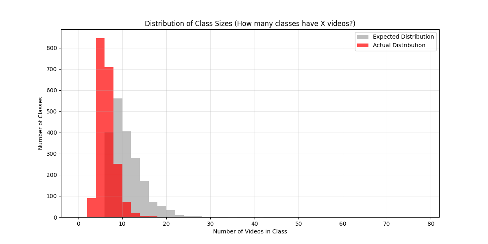

## Project Structure

This project implements an ASL video recognition system using a CNN-LSTM architecture. The codebase processes WLASL (Word-Level American Sign Language) videos to classify isolated signs into gloss categories. The architecture uses a MobileNetV2 backbone (frozen) for spatial feature extraction and an LSTM for temporal modeling. The system supports cached feature extraction to dramatically accelerate training by pre-extracting CNN features to disk. The project includes data utilities for dataset management, resplitting, and visualization.

**Key Components:**

- **Data Pipeline**: `dataset.py` handles video loading, frame extraction, and cached feature management
- **Feature Extraction**: `extract_to_memory.py` pre-extracts CNN features from all videos and saves to disk
- **Model**: `model.py` defines the CNN-LSTM hybrid architecture (MobileNetV2 + LSTM)
- **Training**: `train.py` orchestrates the training loop, validation, and checkpointing
- **Evaluation**: `evaluate.py` runs test set evaluation and computes accuracy metrics
- **Configuration**: `config.py` centralizes all hyperparameters, paths, and training settings
- **Utilities**: `datautils/` contains scripts for dataset analysis, health checks, and data management

## Model Architecture & Pipeline

This project implements a resource-efficient CNN-LSTM architecture designed to recognize isolated American Sign Language (ASL) signs. Due to severe dataset degradation ("link rot") and long-tail distribution in the WLASL dataset, we focused on the Top-100 most frequent gloss categories.

*Figure 1: Distribution of class sizes in the WLASL dataset. The actual distribution (red) shows severe degradation compared to the expected distribution (grey), with most classes having fewer than 10 videos due to link rot.*

### The "Offline Feature Caching" Pipeline

Unlike standard video recognition models that process heavy 3D volumes end-to-end, we engineered a two-stage pipeline to maximize training efficiency on consumer hardware:

**Stage 1: Offline Extraction**: We run the entire video dataset through a frozen CNN backbone once. The resulting feature vectors are serialized and cached to disk.

**Stage 2: Efficient Training**: The LSTM is trained on these lightweight cached embeddings. This reduces training time by >99% (from ~2 hours/epoch to ~1 minute/epoch).

*Figure 2: (A) Offline Extraction via MobileNetV2. (B) Online Feature-Space Augmentation. (C) LSTM Classification.*

### 1. Spatial Backbone (Frozen)

**Architecture**: MobileNetV2 (pre-trained on ImageNet).

**Configuration**: The backbone weights are frozen to act as a fixed feature extractor.

**Output**: We apply Global Average Pooling to the last convolutional layer, resulting in a compact vector of size (1280,) per frame.

**Benefit**: Decoupling the CNN allows us to fit the entire dataset's features into RAM, bypassing repetitive image decoding and forward passes.

### 2. Temporal Modeling (LSTM) & Augmentation

The sequence of cached vectors is fed into a Long Short-Term Memory (LSTM) network.

**Online Feature-Space Augmentation**: Since we cannot apply spatial augmentations (crop/flip) to cached vectors, we implement Temporal Speed Jitter (resampling the sequence length) and Feature Noise on-the-fly during training.

**Network Specs**:

- **Input**: Sequence length fixed to 32 frames.
- **LSTM**: Single-layer with 128 hidden units.
- **Regularization**: Dropout ($p=0.5$) applied to the LSTM output.

### 3. Classification Head

**Layer**: A Fully Connected (Dense) layer maps the LSTM hidden state to the 100 class labels.

**Activation**: Softmax.

## Dataset & Challenges

**Dataset**: WLASL (Word-Level American Sign Language)

**Filtering**:

- **Link Rot**: A significant portion of the original WLASL source videos are no longer available.
- **Few-Shot Regime**: After auditing the dataset, we found that even the Top-100 classes averaged only 9-15 valid training videos per class.

**Scope**: Consequently, this project investigates the limits of static 2D backbones in a few-shot, data-scarce environment.

## Configuration

All hyperparameters, paths, and training settings are centralized in `config.py`, organized by domain for easy modification:

### Model Architecture Parameters

- **`NUM_CLASSES`** (default: 100): Number of top-N most frequent classes to use. Adjust this to train on more/fewer sign categories.
- **`FRAMES_PER_CLIP`** (default: 32): Number of frames extracted per video. Increase for longer temporal context, decrease for faster processing.
- **`LSTM_HIDDEN`** (default: 256): Size of LSTM hidden state. Larger values increase model capacity but require more memory.
- **`NUM_LSTM_LAYERS`** (default: 2): Number of stacked LSTM layers. More layers can capture complex temporal patterns but may overfit with limited data.
- **`LSTM_DROPOUT`** (default: 0.3): Dropout rate for LSTM layers. Increase to reduce overfitting in few-shot scenarios.
- **`FROZEN_CNN`** (default: True): Whether to freeze the MobileNetV2 backbone. Set to `False` to fine-tune the CNN (requires more memory and time).

### Training Hyperparameters

- **`LR`** (default: 1e-4): Learning rate for Adam optimizer. Lower values (1e-5) for fine-tuning, higher (1e-3) for training from scratch.
- **`WEIGHT_DECAY`** (default: 1e-4): L2 regularization strength. Increase to reduce overfitting.
- **`LABEL_SMOOTHING`** (default: 0.05): Label smoothing factor. Helps with noisy labels in few-shot learning.
- **`EPOCHS`** (default: 150): Number of training epochs. Adjust based on convergence and early stopping.

### Data Loading & Performance

- **`BATCH_SIZE`** (default: 32): Training batch size. Reduce if running out of GPU memory, increase for faster training on larger GPUs.
- **`NUM_WORKERS`** (default: 0): Data loading workers. Set to 0 for Windows/OpenCV compatibility, increase (2-4) on Linux for faster loading.
- **`USE_CACHED_FEATURES`** (default: True): Use pre-extracted features. Set to `False` to process raw videos (much slower).
- **`AUGMENT_ENABLED`** (default: True): Enable temporal augmentation. Disable for deterministic training.

### Dataset Paths

Update these paths to point to your dataset location:

- **`TRAIN_JSON_PATH`**, **`VAL_JSON_PATH`**, **`TEST_JSON_PATH`**: Paths to train/val/test split JSON files
- **`VIDEO_DIR`**: Directory containing video files
- **`FEATURE_FILE`**: Path where cached features are saved/loaded

## References

This project is inspired by and built upon the following academic papers and architectures:

- **MobileNetV2**: Sandler, M., Howard, A., Zhu, M., Zhmoginov, A., & Chen, L. C. (2018). *MobileNetV2: Inverted Residuals and Linear Bottlenecks*. arXiv:1801.04381

- **LSTM**: Hochreiter, S., & Schmidhuber, J. (1997). *Long Short-Term Memory*. Neural Computation

- **I3D (Baseline)**: Li et al. (2020). arXiv:11910.11006

- **Feature Augmentation**: Laines et al. (2023). *Isolated Sign Language Recognition Based on Tree Structure Skeleton Images*.
